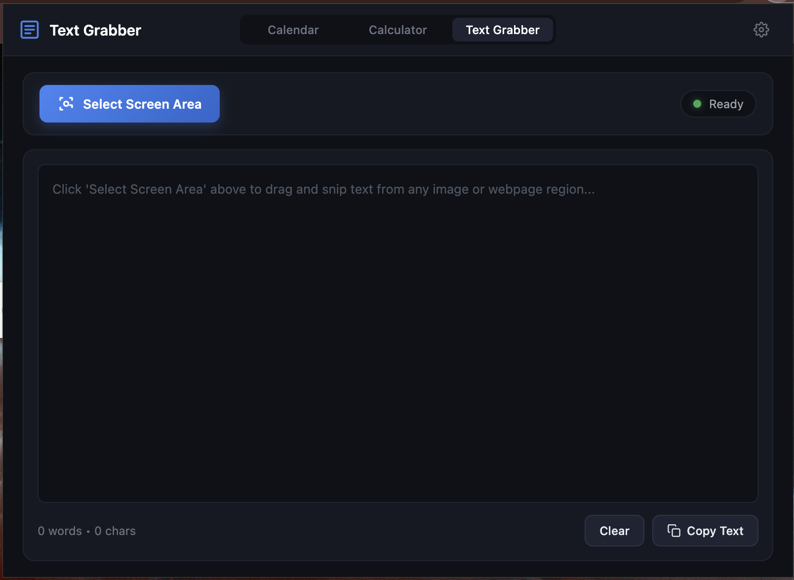

# CalendarKit 🗓️

> Your Mac's missing taskbar — instant Calendar, Calculator, and **Text Grabber (OCR)**. Right where you work.


---

## The Problem

If you've ever switched from **Windows to Mac**, you know this feeling.

On Windows, you click the clock in the taskbar — and boom, a full calendar pops up. You can check next month, the month after, scroll through dates, all without ever leaving what you were doing. It's seamless.

On Mac? Click the clock. You see today's date. That's it.

Want to check what day December 15th falls on? You have to:
1. Open the Calendar app
2. Watch it take over your screen
3. Navigate to December
4. Check your date
5. Close the app
6. Find your way back to what you were doing

Every. Single. Time.

And calculators or copying text from images/unselectable text on screen? Same story. You're in the middle of a spreadsheet, a document, a video, or an image — and you need to copy text or do a quick calculation. On Mac, you're opening separate apps or tools, switching contexts, losing your flow.

**This constant context switching kills productivity.** And it's completely unnecessary.

---

## The Solution

**CalendarKit** brings the Windows taskbar experience to your Mac — as a Chrome extension.

Click the icon in your toolbar. Your full Google Calendar appears, right there, without switching screens. Check any month, any year. See your events. Then close it and continue exactly where you left off.

Need to calculate something? Switch to the built-in Calculator tab — without opening a single new window.

Need to copy text from an image, diagram, PDF, or uncopyable webpage? Switch to the **Text Grabber** tab, click **Select Screen Area**, drag a box over any screen area, and instantly get the extracted text in your editor with a 1-click Copy button!

**Everything you need. Right where you are.**

---

## Features

### 📅 Full Google Calendar
- Complete monthly calendar view in a popup
- Navigate to **any month, any year** — forward or backward
- See all your events at a glance
- One-click to open full Google Calendar in a new tab
- Refresh button to sync latest events

### 🧮 Built-in Calculator
- Clean, fast calculator — always one click away
- Full expression support including brackets `(2+3)*4`
- **Persistent history** — your calculations survive browser restarts
- Click any history item to reuse the result
- Keyboard support — type naturally with numpad or keyboard

### 🔍 Text Grabber (Screen OCR Text Extractor)
- **Select Any Screen Area**: Click "Select Screen Area" to darken the screen and use a custom crosshair cursor to drag-select any text on screen.
- **Copy Uncopyable Text**: Easily extract text from images, non-selectable web text, diagrams, videos, PDFs, and canvas elements.
- **1-Click Copy & Clean Editor**: View extracted text in a clean monospace editor with real-time word and character counters, and copy it to your clipboard with 1 click.
- **100% Offline & Private**: Runs client-side WASM OCR completely on your machine. Zero network calls, zero data uploads, zero external tracking.

### ⚙️ Smart Settings
- Set your **default tab** — Calendar, Calculator, or Text Grabber
- CalendarKit remembers your preference automatically
- Change your calendar URL anytime

### 🎨 Design
- Dark theme — easy on the eyes
- Clean, minimal interface — no clutter
- Glassmorphic UI with smooth micro-animations

### 🔒 Privacy & Security First (Chrome Web Store Compliant)
- **100% Local Processing**: All calendar views, calculations, and OCR text extractions are executed locally inside your browser.
- **Zero External Telemetry**: No third-party servers, no analytics, no external script imports.
- **Manifest V3 Compliant**: Adheres to strict Chrome Extension Content Security Policy (`script-src 'self' 'wasm-unsafe-eval'`).
- **No Data Collection**: Your schedule, calculations, and grabbed text never leave your computer.

---

## Screenshots

| Calendar View | Calculator View | Text Grabber View | Settings |
|---|---|---|---|
|  |  |  |  |

---

## Installation

### From Chrome Web Store
[Install CalendarKit](https://chromewebstore.google.com/detail/nhcbepdcigkmidijjchdfnngloaemfcn)

### Manual Install (Developer Mode)

1. Clone this repository
```bash
   git clone https://github.com/pSarveshKr/CalendarKit.git
```
2. Open Chrome and go to `chrome://extensions`
3. Enable **Developer mode** (top right toggle)
4. Click **Load unpacked**
5. Select the `CalendarKit` folder
6. The CalendarKit icon will appear in your toolbar

---

## How to Use Text Grabber

1. Open the CalendarKit extension from your Chrome toolbar.
2. Click on the **Text Grabber** tab (or set it as your Default Tab in Settings).
3. Click the **"Select Screen Area"** button.
4. The extension popup will close, and your screen will dim slightly with a crosshair cursor (`+`).
5. Click and drag over any area containing text (images, slides, PDFs, code, unselectable webpage text).
6. Release the mouse button — CalendarKit automatically captures the region, runs OCR, re-opens the extension popup, and displays the extracted text in the editor.
7. Click **"Copy Text"** to copy the extracted text to your clipboard!

---

## Privacy & Security Statement

CalendarKit collects **absolutely no data**.

- Your calendar URL is stored locally using Chrome's `storage.local` API.
- Your calculator history stays strictly on your device.
- All OCR text extractions run 100% client-side using bundled local WebAssembly scripts.
- No screenshots or extracted text are ever transmitted to any remote server or third party.
- No analytics, no tracking scripts, no remote code execution.

---

## License

MIT License — free to use, modify, and distribute.

---

## Support

If CalendarKit made your workflow easier, consider buying me a coffee ☕

[](https://ko-fi.com/psarveshkr)
