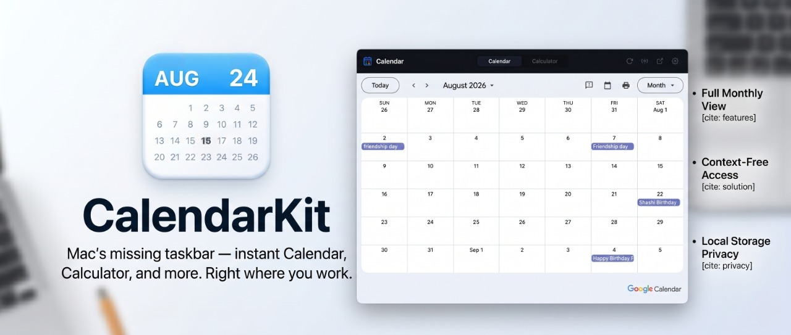
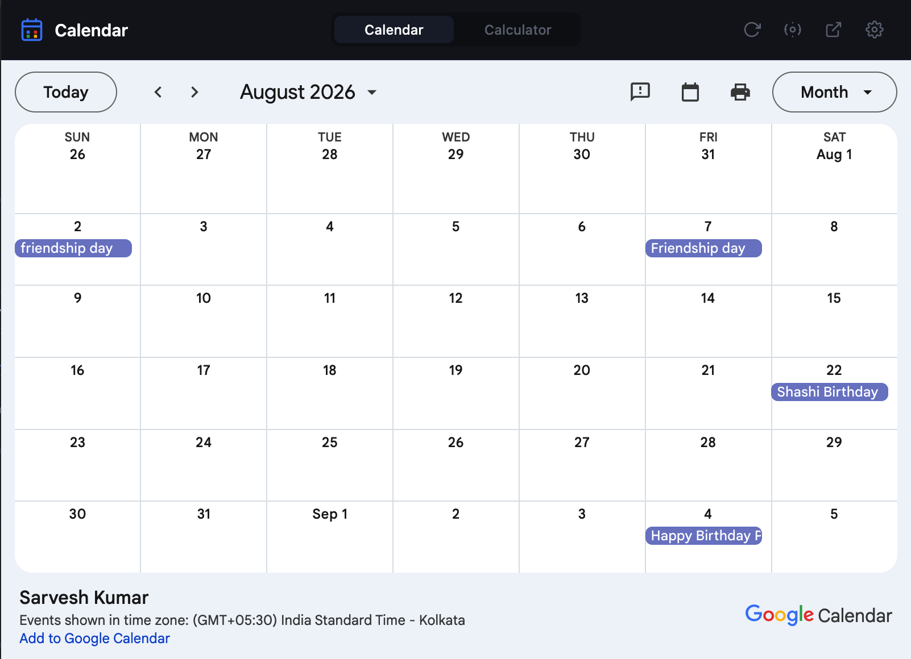
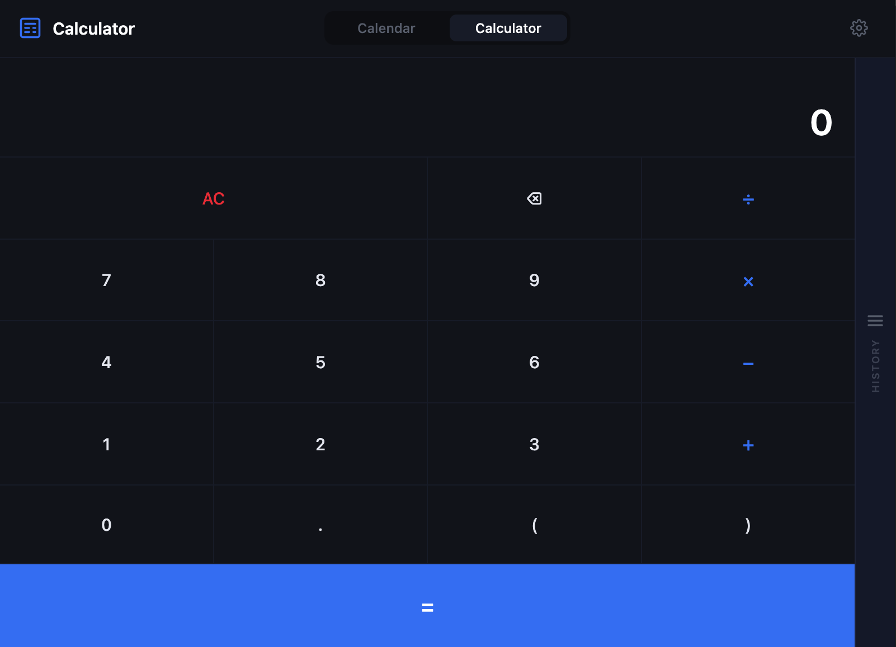
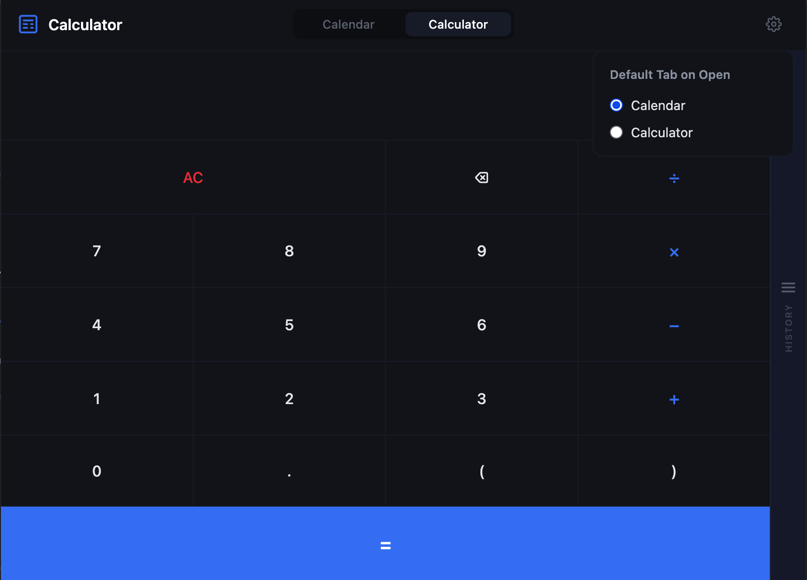
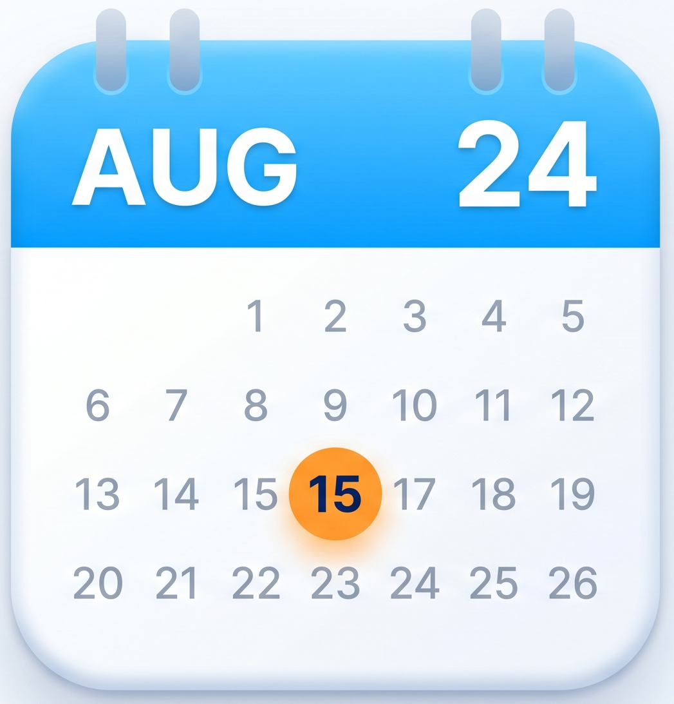

# CalendarKit 🗓️

> Your Mac's missing taskbar — instant Calendar, Calculator, and more. Right where you work.



---

## The Problem

If you've ever switched from **Windows to Mac**, you know this feeling.

On Windows, you click the clock in the taskbar — and boom, a full calendar pops up. You can check next month, the month after, scroll through dates, all without ever leaving what you were doing. It's seamless.

On Mac? Click the clock. You see today's date. That's it.

Want to check what day December 15th falls on? You have to:
1. Open the Calendar app
2. Watch it take over your screen
3. Navigate to December
4. Check your date
5. Close the app
6. Find your way back to what you were doing

Every. Single. Time.

And calculators? Same story. You're in the middle of a spreadsheet, a document, a browser tab — and you need to do a quick calculation. On Windows, it's a keyboard shortcut away, right on your current screen. On Mac, you're opening a separate app, switching contexts, losing your flow.

**This constant context switching kills productivity.** And it's completely unnecessary.

---

## The Solution

**CalendarKit** brings the Windows taskbar experience to your Mac — as a Chrome extension.

Click the icon in your toolbar. Your full Google Calendar appears, right there, without switching screens. Check any month, any year. See your events. Then close it and continue exactly where you left off.

Need to calculate something? Switch to the built-in Calculator tab — without opening a single new window.

**Everything you need. Right where you are.**

---

## Your Google Calendar. Always Within Reach.

CalendarKit doesn't just show you a calendar — it connects directly to **your** Google Calendar.

Every event you've created. Every meeting you've scheduled. Every birthday, anniversary, deadline, and reminder — all visible in one click, without leaving your current tab.

> Imagine you're deep in a document and you wonder — *"Do I have anything important next Friday?"*
> With CalendarKit, you find out in 2 seconds. Not 20.

### What you'll never miss again:
- 📌 **Upcoming meetings** — see what's coming this week at a glance
- 🎂 **Birthdays & anniversaries** — never forget an important date
- ⏰ **Deadlines** — know exactly how many days you have left
- 📍 **Recurring events** — your weekly standups, monthly reviews, all visible
- 🗓️ **Future planning** — check if December 25th is a Friday before you make plans

### It's your calendar. Now it's also your co-pilot.

No more *"let me open my calendar app"*. No more switching screens. No more losing your train of thought.

Your schedule lives in your toolbar now.

---

## Features

### 📅 Full Google Calendar
- Complete monthly calendar view in a popup
- Navigate to **any month, any year** — forward or backward
- See all your events at a glance
- One-click to open full Google Calendar in a new tab
- Refresh button to sync latest events

### 🧮 Built-in Calculator
- Clean, fast calculator — always one click away
- Full expression support including brackets `(2+3)*4`
- **Persistent history** — your calculations survive browser restarts
- Click any history item to reuse the result
- Keyboard support — type naturally with numpad or keyboard

### ⚙️ Smart Settings
- Set your **default tab** — Calendar or Calculator
- CalendarKit remembers your preference
- Change your calendar URL anytime

### 🎨 Design
- Dark theme — easy on the eyes
- Clean, minimal interface — no clutter
- Smooth animations
- Dynamic toolbar icon showing today's date

### 🔒 Privacy First
- Zero data collection
- Everything stored locally on your device
- No accounts, no sign-ups, no tracking

---

## Screenshots

| Calendar View | Calculator View | Settings |
|---|---|---|
|  |  |  |

> 📸 *Screenshots coming soon — feel free to contribute!*

---

## Demo

[](https://your-demo-video-link.com)

> 🎥 *Video walkthrough coming soon*

---

## Installation

### From Chrome Web Store
*(Coming soon — link will be added here)*

### Manual Install (Developer Mode)

1. Clone this repository
```bash
   git clone https://github.com/yourusername/CalendarKit.git
```
2. Open Chrome and go to `chrome://extensions`
3. Enable **Developer mode** (top right toggle)
4. Click **Load unpacked**
5. Select the `CalendarKit` folder
6. The CalendarKit icon will appear in your toolbar

---

## Setup

### Connect Your Google Calendar

1. Go to [Google Calendar](https://calendar.google.com)
2. Click the **Settings** gear icon ⚙️
3. Select your calendar from the left sidebar
4. Scroll down to **Integrate calendar**
5. Copy the **Public URL to this calendar** (embed URL)
6. Click the CalendarKit icon → paste the URL → click **Load Calendar**

> ✅ Your calendar is now connected. It remembers your URL — you only do this once.

---

## Who Is This For?

- 🖥️ **Windows switchers** who miss the taskbar calendar
- 💼 **Professionals** who live in their browser all day
- 📊 **Anyone** who hates switching apps for simple tasks
- 🧑‍💻 **Developers, designers, writers** — anyone in deep focus mode
- 📅 **Google Calendar users** who want their schedule always one click away

---

## Roadmap

CalendarKit is built to grow. Planned utilities:

- [ ] World Clock — multiple timezones at a glance
- [ ] Quick Notes — jot something fast without leaving your tab
- [ ] Unit Converter — length, weight, temperature, currency
- [ ] Pomodoro Timer — focused work sessions built in
- [ ] Countdown — days until an important date

---

## Contributing

Have an idea for a utility that would make your daily workflow easier?

**We'd love to hear from you.**

- 📧 **Email:** cyphonplay@gmail.com
- 🐛 **Bug reports:** [Open an issue](https://github.com/yourusername/CalendarKit/issues)
- 💡 **Feature requests:** [Start a discussion](https://github.com/yourusername/CalendarKit/discussions)
- 🔧 **Want to contribute?** Fork the repo and open a Pull Request — all contributions welcome

If there's a tool or utility missing from your daily life that fits the CalendarKit philosophy — **staying in your current screen** — drop us a message. We build what users actually need.

> 💬 *Have a utility idea? Drop a mail or open a PR — if it keeps you on your current screen and makes life simpler, it belongs in CalendarKit.*

---

## Privacy

CalendarKit collects absolutely no data.

- Your calendar URL is stored locally using Chrome's storage API
- Your calculator history stays on your device
- Your preferences never leave your browser
- No analytics, no tracking, no servers

[Read full Privacy Policy](./privacy-policy.html)

---

## License

MIT License — free to use, modify, and distribute.