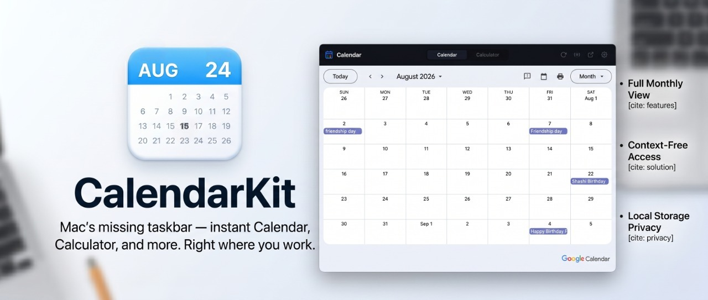
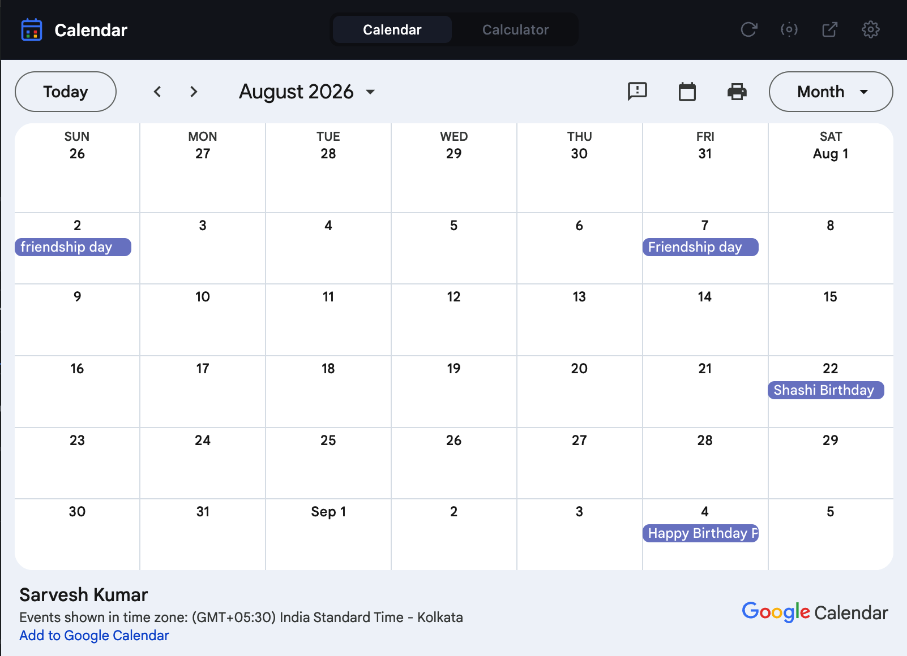
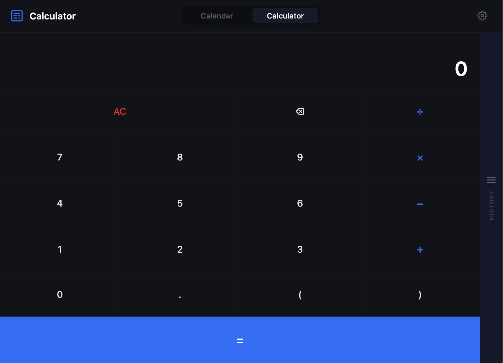
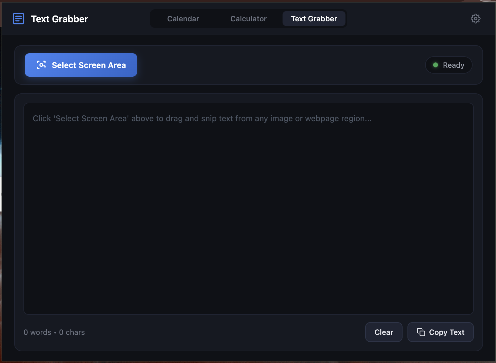
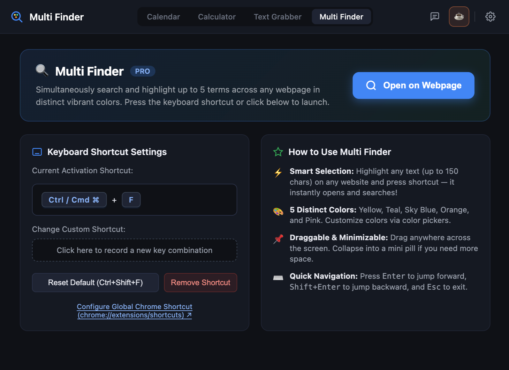

<div align="center">

# CalendarKit 🗓️

**The All-in-One Productivity Powerpack for Chrome & Mac**

Instant Google Calendar, Smart Calculator, Offline Screen OCR, and Multi-Term Web Highlighter — right where you work.

[](https://chromewebstore.google.com/detail/nhcbepdcigkmidijjchdfnngloaemfcn)
[](#)
[](#privacy--security)
[](./LICENSE)

<br/>



</div>

---

## 💡 Why CalendarKit?

Switching contexts breaks your flow. You shouldn't have to open separate applications or leave your active webpage just to check a date, calculate a quick number, grab text from an image, or search multiple keywords across a document.

**CalendarKit brings essential everyday tools into one unified, distraction-free extension:**

- 📅 **Google Calendar at a Glance** — View months, years, and your full schedule without launching a heavy calendar window.
- 🧮 **Instant Calculator** — Calculate math expressions with history retention right in your toolbar.
- 🔍 **Text Grabber (OCR)** — Select any area of your screen to extract uncopyable text from images, slides, videos, and PDFs.
- ⚡ **Multi Finder** — Search and highlight up to **5 different terms simultaneously** with vibrant colors on any webpage (`Cmd+Shift+F` / `Ctrl+Shift+F`).

---

## ✨ Features at a Glance

### 📅 Google Calendar
* Full monthly interactive calendar view in a lightweight popup.
* Seamless navigation across any month or year.
* Real-time event sync and 1-click shortcut to open the full calendar in a new tab.
* Switch between multiple calendar accounts effortlessly.

### 🧮 Built-in Calculator
* Always one click away — no need to open a separate app.
* Supports complex expressions and brackets, e.g. `(250 * 1.18) - 45`.
* **Persistent History**: Survives browser restarts; click any past calculation to reuse it.
* Full keyboard and numpad support for rapid calculations.

### 🔍 Text Grabber (Offline Screen OCR)
* **Drag-to-Select**: Click "Select Screen Area" to draw a box over any screen region.
* **Copy Uncopyable Text**: Extract text from images, diagrams, video frames, PDFs, and protected websites.
* **1-Click Copy**: Extracted text appears in a clean editor with word/character counters.
* **100% Offline & Private**: Powered by local WebAssembly. Zero data uploads, zero cloud tracking.

### ⚡ Multi Finder (Multi-Term Highlighter)
* **Simultaneous 5-Color Search**: Highlight up to 5 different terms at once with distinct pastel colors.
* **Smart Selection Auto-Fill**: Highlight text on any website and press `Cmd+Shift+F` (Mac) or `Ctrl+Shift+F` (Windows) to instantly search it.
* **Sequential Terms**: Press the shortcut on new selections to automatically populate Term 2, 3, 4, and 5!
* **Customizable Shortcut (Replace Native Ctrl+F)**: Record any custom shortcut directly in the popup. You can even set it to **`Ctrl+F`** (or **`Cmd+F`**) to replace Chrome's basic single-word search bar with this advanced multi-color finder — everything runs smoothly with zero conflicts.
* **Per-Term Filters**: Independent **Aa** (Match Case) and **W** (Whole Word) toggles for each search field.
* **Seamless Match Navigation**: Dedicated `▲` / `▼` buttons and `Enter` / `Shift+Enter` keys with real-time counters (`1/12`).
* **Draggable & Minimizable**: Move the search overlay anywhere on screen (double-click header to reset), or collapse it into a sleek mini pill.
* **Persistent Colors**: Pick any custom highlight color — your preferred colors stay saved and synced across all tabs.
* **Shadow DOM Isolation**: Runs inside an isolated Shadow DOM (`z-index: 2147483647`) so webpage styling never breaks the interface.

---

## 📸 Screenshots

| Google Calendar | Calculator |
|:---:|:---:|
|  |  |

| Text Grabber (OCR) | Multi Finder (Multi-Term Highlighter) |
|:---:|:---:|
|  |  |

---

## 🚀 Installation

### Option 1: Chrome Web Store (Recommended)
Install directly with 1 click from the [Chrome Web Store](https://chromewebstore.google.com/detail/nhcbepdcigkmidijjchdfnngloaemfcn).

### Option 2: Manual Installation (Developer Mode)
1. Clone this repository:
   ```bash
   git clone https://github.com/pSarveshKr/CalendarKit.git
   ```
2. Open Chrome and navigate to `chrome://extensions`.
3. Enable **Developer mode** (toggle in the top-right corner).
4. Click **Load unpacked** and select the `CalendarKit` directory.
5. Pin **CalendarKit** to your Chrome toolbar and enjoy!

---

## 🔒 Privacy & Security

CalendarKit is built with a strict **privacy-first** architecture:
* **Zero Telemetry**: No third-party servers, no analytics, no external tracking scripts.
* **100% Client-Side**: Calendar data, calculations, OCR images, and search terms execute entirely inside your local browser memory.
* **Manifest V3 Compliant**: Adheres to Google Chrome's highest security standards.
* **No Cloud Storage**: Your preferences and history stay securely on your device.

---

## 📄 License

This project is licensed under the [MIT License](./LICENSE) — free to use, modify, and distribute.

---

## ☕ Support

If CalendarKit helps boost your daily productivity, consider supporting its development:

[](https://ko-fi.com/psarveshkr)
